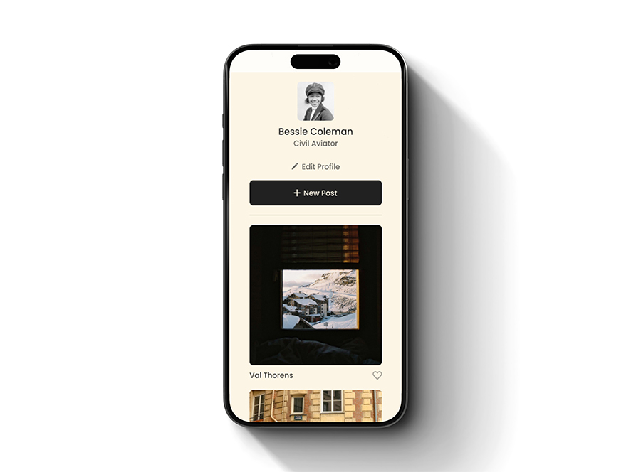
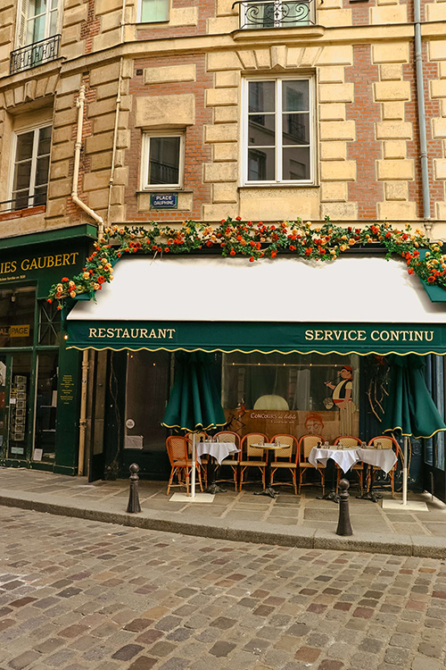

# Project 3: Spots

### Overview

- Intro
- Tech Stack
- Images
- Deployment
- Video

**Intro**

'Spots' is an interactive social media web application where users can share and manage their favorite photos, interact with others by liking their posts, and personalize their user profiles. The website features a modern and responsive profile section, a grid layout for displaying your favorite images, and an easy-to-navigate layout suitable for desktop, tablet, and mobile views.

**Tech Stack**

- HTML
- CSS
- Responsive Design

**Images**

**Deployment**

This webpage is deployed to Github Pages:

- Deployment link: https://priggles.github.io/se_project_spots/

**Video**

My video for the project (captions available):

https://drive.google.com/file/d/1of28IhQNLzqRdF-ZWd3Eo0O_YiAITg4D/view?usp=sharing
